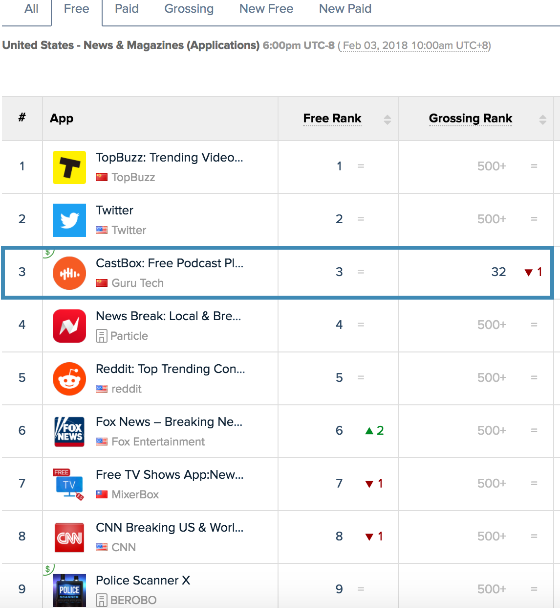

---
title: "ContentBox"
subtitle: "A Decentalized Ecosystem for the Digital Content Industry of Tomorrow"
author: [CastBox.fm]
date: 2018-02-04
titlepage: true
titlepage-color: 1565c0
titlepage-text-color: ffffff
titlepage-rule-color: ffffff
titlepage-rule-height: 1
...

\tableofcontents

\newpage

# Introduction

## Problem Statement

In diversity we believe.

During the past years, we all witnessed the exploding growth of the digital content industry led by a vareity of web content platforms and mobile apps, such as Reddit, Youtube and Spotify. As the developer of CastBox, we are glad to see the great achievements made by all players in this area; however, we cannot deny the fact that the __properity__ and __diversity__ of the whole industry are still suffering from several long-standing problems:

+ **Poor protection for original contents and real creators.** IP piracy continues to be a headache for the digital content industry. In some markets, consumers have developed an expectation that digital content should be free or priced low, putting downward pressure on pricing of subscriptions. Audio or video content, either curated by professionals or generated by normal users, is available in an array of easily accessible forms, including through online downloads, purchase on USB devices, and conversion into files from YouTube videos. Just take a look at those who move video clips from Youtube to local video platforms and garner a number of fans in this way, anyone will realize how severe this problem is. The future of the econtent industry is doomed if we cannot stop this kind of pivacy behavior.

+ **Central censorship.** Some may argue that the central censorship is necessary to filter spam and build a healthy online community and totally legal in many countries. However, in today's world where we are all connected by the Internet, censorship is becoming more and more counterproductive, not only because it kills diversity by preventing us from discussing the censored topic, but also because it cannot eliminate real spams effectively under the circumstances of the explosion of user-gernerated contents. 

+ **The decisive role of distributors.** There are many stakeholders in the digital content area: artists, consumers, investors, advertisers and distributors. It is well known that the distributors are playing the most important role in today's ecosystem, especially those big web or mobile content platforms such as Youtube or Spotify. They are holding large amount of web traffic and they decide how to dispatch the traffic. Compared with the central large platform, both creators and audiences are in weak postion and lack of bargin power when discussing the monetization and payout mechanisms. Therefore, as we can see, most of the revenue will be taken by the platform and most content creators can just collect a small part of the pie. On the other hand, the high traffic acquisition cost of the central platform will be transferred to the content consumers. They either have to pay unfair subscription fees or tolerate longer and longer ad clips.

## A Blockchain-based Ecosystem: ContentBox

Our solution to the problems mentioned above is a blockchain-based ecosystem: ContentBox. 

Unlike the traditional open platforms, such as App Store or Wechat Open Platform[^fn6], ContentBox is fully __decentralized, autonomous, and driven by the open source community instead of a giant firm in the industry__. By leveraging the blockchain as an open, immutable, distributed, and temper-proof database, web or mobile content platforms can share rights data without ceding control to a third party. Fast on-chain settlement of transactions will also help a song writer to gain his share directly when an audience streams his song in an app. 

In principle, ContentBox is designed to benefit all participants in the industry, including but not limited to, internet scale platforms, creators, app developers and normal audiences, allowing them to collaborate, innovate and build new generation of digital content applications that play on fair terms. For content creators, they now have a better protection for their IP rights and will get paid more for their artworks; for content consumers, they can watch a tv show or listen to a lecture without being subscribed to any specific service (they can pay by the tokens they earned from contributing to the community); for those big distribution platforms, they will also benefit from lowering the traffic acquisition cost and IP purchase cost. ContentBox can even bring benefits to the investors by allowing them to participate in many micro crowd-fundings started by various artists instead of betting large amount money on one project.

## A New Cryptocurrency: BOX

## The Foundation

To oversee the growth of the ContentBox Ecosystem, we have set up an entity the Contentbox Foundation in Singapore. The Foundation will administer the use of the proceeds and ensure the healthy circulation of the BOX token. Our ultimate goal is to build a fully decentralized and autonomous ecosystem for the digital content industry. Therefore, we would like to make the governance and operation of the Foundation as transparent as possible. As a matter of fact, we are planning to __build the Foundation as a totally software defined organization in the future__. 

As the founding member of the ContentBox Foundation, CastBox will pioneer the transition from a centralized app to a decentralized blockchain-based app and introduce BOX to its tens of millions of users. In the near future, CastBox will also open source the vast majority of its codebase after it integrates BOX into the app successfully, encouraging the open source community to drive the evolution of ContentBox.

# About CastBox

CastBox is an award-winning global spoken audio platform and podcast player that intelligently recommends the most relevant on-demand radio, podcasts and audiobooks. 

Founded by an ex-Googler, the CastBox team is now a 50-person team with 10+ years of experience in internet companies such as Google, Facebook, and Alibaba. The team launched the first version of CastBox in early 2016, and now CastBox has been one of the most popular mobile apps on iOS[^fn5] and Android[^fn4].

## Key Facts

- $30M in funding from top equity venture capitals like IDG, SIG, Qiming, GSR, ZhenFund.
- Top 5 news/magazine app in the US, 4.7 rating on Google Play
- 12 million users across all platforms in 135 countries; 50% monthly retention rate
- 50 million volumes of audio content in 70 languages
- Team of 50 from Peking Univ., Tsinghua Univ., Google, Tencent, Alibaba, Toutiao etc; Global offices in Beijing, San Francisco, New York, Korea, Hong Kong
- Key features include In-Audio Search, which allows users to search for keywords within any audio files; personalized recommendations; free uploading

## Achievements

- Winner of the 2017 Google Global Android Excellence Program award 
- Nominated for the 2017 Standout Startup award by Google play
- Winner of the 2017 Best App of Google Play (Best Daily Helper and Best Hidden Gem) award
- Given Most Entertaining of Best Apps 2016 title by Google Play
- Winner of Judges' Choice Award of the Google Demo Day 2016 Women's Edition
- Winner of 2016’s Top Trending Apps of Global Best by Google Play
- Editor’s Choice award in 135 countries featured by Google Play

# Uses of BOX as a Cryptocurrency

## Replacing Advertising with Token-based Reward System

## Motivating Channels to Distribute Content Actively

## Fighting Against Spams

## Suppressing Vicious Competition

# Technology

## Why A New Platform?
The current mainstream blockchain networks, such as Bitcoin and Ethereum, are not a natural fit for the digital content industry due to the following reasons: 

+ **Long transaction delays & low throughput.** The digital content industry is quite different from finance or e-commerce world in terms of action frequency. Typically we might transfer our money or buy/sell goods several times a day, but on a digital content platform, a teenager might do way more actions, like streaming a song or watching a movie clip or tipping an article writer. In other words, we are expecting way larger transaction volume in the online digital content world. This trait of the digital content industry determines that current Bitcoin or Ethereum platform cannot meet the needs from real world, which leaves us no choice but to find novel solutions and build a new blockchain platform. 

+ **No privacy in smart contracts.** In Ethereum all smart contracts are stored publicly on the nodes of the blockchain, which introduces severe privacy problems. Due to the visibility of the contracts, a normal streamer's taste or preferences may be detected and published to a lot of people he may not know. Likewise, a content producer might also worry that his or her profit sharing plan be searched by outsiders and leaked to the public. Furthermore, the increasing complexity of smart contracts can bring security risks. We all know what happened to DAO.

+ **High transaction fees.** High transaction cost means there is no real micro-payment; and without micro-payments, fans cannot support content creators with small donations, neither can they pay for watching just an episode of a series show nor access to limited content like a VIP club. The digital content industry needs a frictionless micro-payment system to cultivate an active and healthy community. 

In conclusion, current mainstream chains cannot serve as the foundation of a decentralized digital content ecosystem. To address the aforementioned challenges, CastBox will propose and lead the open source development of _BOX Chain_, a decentralized data and payment network that will benefit all the participants in the industry.

## BOX Chain

To make it very clear, we are NOT trying to build an upgraded Ethereum that meets any needs of various industries. Instead, the BOX Chain is built on the design of Bitcoin but with much larger TPS. While various transactions can be completed on the BOX Chain in a fast and reliable way, __the chain itself does not plan to support a general purpose Turing-complete virtual machine like EVM.__

Our design of the BOX Chain follows the __UNIX philosophy__: building a large system on top of a series of simple, modular, and reliable small parts. Instead of using a large, expensive-to-verify blockchain, we use small, parellel, mobile-friendly micro chains. Using programming language metaphor, __we can view Bitcoin as the C in the blockchain realm, while Ethereum as Java; then our BOX chain can be thought of as the Go in the blockchain world__. Just like go routines in the Go language, the micro chains will be tiny in terms of physical size and will be powerful as well. The micro chains will play the most important role in our BOX Chain. 

## Off-chain "Smart Contract"
Since the birth of Ethereum, smart contracts have been an indispensable part for many blockchain projects. However, most contracts need only one thing from the blockchain: an immutable ordering of commitments to prevent double-spending. Therefore, we decide to move the bulk of smart contracts off the chain. Instead of using complex and resource intensive smart contracts to align the interests of stakeholders and automate payment related transactions, we aggregate simple signatures to achieve the same goal but with much higher performance. By using signature itself as a witness, we can move the bulk of transactions off-chain and leave the blockchain to do what it is really good at: check a multi-sig. 

A crucial piece of this approach is Schnorr Signature[^fn1]. Unlike ECDSA, Schnorr signature has **linearity** in its math, which makes it ideal for creating "adaptor signature" that can be used in settling off-chain transactions automatically. Actually, based on the exciting progress made recently in this research area spearheaded by Andrew Poelstra, a mathematician from Blockstream, we are exploring this technology to build a light-weight but powerful blockchain that suits for the digital content industry. 

## One Passport
We are planning to build a powerful decentralized identity service "One Passport", allowing the users to transact frictionlessly **across multiple apps or websites**. Furthermore, it will bind a creator to his artworks transparently and permanently, which helps him to build his reputation in the digital content world. On the other hand, this identity service will also help content consumers to own an ongoing reputation and experience on different web or mobile platforms with one identity. We will investigate a few third-party identity services such as uPort[^fn2] or Keybase[^fn3], to decide whether we integrate it into our One Passport service; or we will develop our own solution if we find they cannot meet the needs of the ecosystem.

# Token Allocations

Before the official launch of the native blockchain on the ContentBox Platform, BOX will be launched using Ethereum ERC 20 token standard.

Propotion | Usage | Detail |
|---|---|--------|
25% | Pre-sale | Target selected institutional investors, with a 6-month locking period. |
15% | Team | Rewards for in-house dev team and open-source contributors with a 4-year vesting period. |
30% | Ecosystem Incentives | Incentive all participants in the ecosystem, such as the creators, the audiences, the individual investors, the platform, etc. |
20% | Foundation | Protect the BOX token from speculative trading and fund the operations of the foundation. |
10% | Partnership | To fund the bounty program and build partnership with other audio/vedio websites or mobile apps. |

# Roadmap

- 2016.02 CastBox team founded
- 2016.02 CastBox for Android launched
- 2017.01 CastBox for iOS launched
- 2018.02 Token sale
- 2018.06 Token integrated into CastBox app
- 2018.12 Testnet of BOX Chain online 
- 2019.06 Launch BOX Chain V1.0 

# Team

[^fn1]: Technology roadmap - Schnorr signatures and signature aggregation
\hfill\break
https://bitcoincore.org/en/2017/03/23/schnorr-signature-aggregation/
[^fn2]: https://www.uport.me/
[^fn3]: https://keybase.io/
[^fn4]: https://play.google.com/store/apps/details?id=fm.castbox.audiobook.radio.podcast
[^fn5]: https://itunes.apple.com/app/castbox-radio/id1243410543
[^fn6]: https://open.weixin.qq.com/
